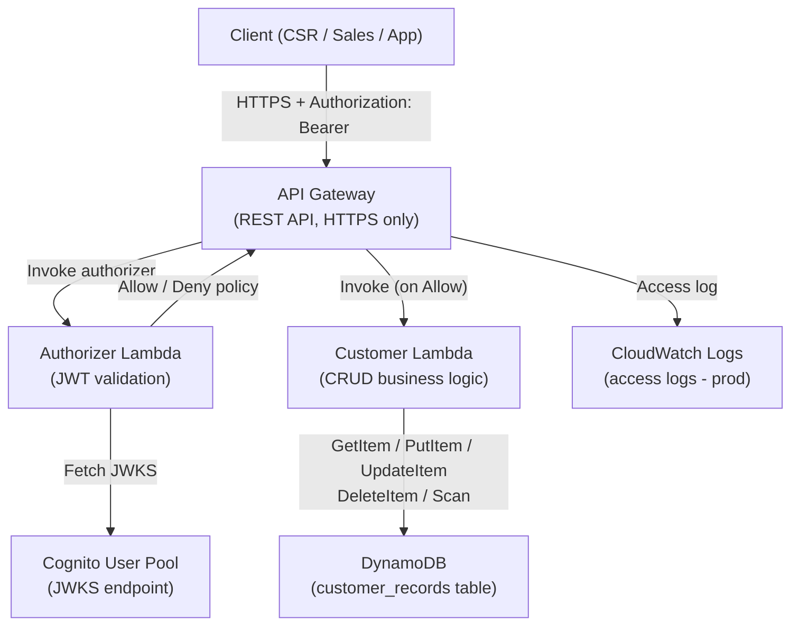

# Design Document: Customer Management Platform

## Overview

The Customer Management Platform is a serverless REST API that gives AnyCompany a single authoritative source of customer data. It replaces fragmented spreadsheets and legacy systems with a centralized, secure, and scalable solution backed by AWS managed services.

The system is built entirely on AWS and managed via Terraform. All business logic runs in Python Lambda functions. API Gateway handles HTTP routing and invokes a Lambda Authorizer to validate Cognito-issued JWTs on every request before any business-logic Lambda is reached.

### Key Design Decisions

- **Serverless-first**: Lambda + API Gateway eliminates server management, scales automatically, and reduces operational overhead.
- **Cognito for identity**: Offloads authentication complexity (token issuance, JWKS rotation, password policy enforcement) to a managed AWS service.
- **DynamoDB for storage**: Provides single-digit millisecond reads/writes, automatic scaling, and native UUID primary keys — a natural fit for customer record CRUD.
- **Lambda Authorizer**: Centralizes JWT validation in one place rather than duplicating it across business-logic Lambdas.
- **Terraform IaC**: All resources are version-controlled and reproducible, following AWS Prescriptive Guidance for Terraform project structure.

---

## Architecture



### Request Flow

1. Client sends an HTTPS request to API Gateway with a `Bearer` JWT in the `Authorization` header.
2. API Gateway invokes the Authorizer Lambda, passing the token.
3. Authorizer fetches Cognito's JWKS, validates signature, expiry, issuer, and audience.
4. On success, Authorizer returns an IAM Allow policy; on failure it returns Deny (→ HTTP 401).
5. API Gateway routes the allowed request to the Customer Lambda.
6. Customer Lambda validates the request body, executes the DynamoDB operation, and returns the HTTP response.

---

## Components and Interfaces

### 1. API Gateway (REST API)

- **Endpoints**

  | Method | Path | Description |
  |--------|------|-------------|
  | POST | `/customers` | Create a new customer |
  | GET | `/customers` | List customers (≤100, paginated) |
  | GET | `/customers/{customer_id}` | Retrieve a customer by ID |
  | PUT | `/customers/{customer_id}` | Replace a customer record |
  | DELETE | `/customers/{customer_id}` | Delete a customer record |

- **Authorization**: Every endpoint uses a token-based Lambda Authorizer (result cache TTL configurable per environment).
- **HTTPS**: TLS enforced; HTTP is not enabled.
- **Access logging** (production): Each entry includes `requestId`, HTTP method, resource path, response status, and timestamp.

### 2. Authorizer Lambda (`src/authorizer/lambda_function.py`)

Receives the raw `Authorization` header value from API Gateway and returns an IAM policy document.

**Validation steps** (all must pass):

1. Token is present and well-formed (three Base64url segments).
2. Fetch JWKS from Cognito's well-known endpoint and select the matching `kid`.
3. Verify RSA signature.
4. Check `exp` claim — reject if expired.
5. Check `iss` claim matches the configured Cognito User Pool issuer URL.
6. Check `aud` claim matches the configured App Client ID.

On any failure: return Deny policy (API Gateway translates to HTTP 401).

**Dependencies**: `python-jose`, `boto3`, `datetime` (standard library).

### 3. Customer Lambda (`src/customers/lambda_function.py`)

Single Lambda function that handles all five CRUD routes. The entry point reads `httpMethod` and `resource` from the event to dispatch to the appropriate handler.

**Handler dispatch:**

```
POST   /customers              → create_customer(event)
GET    /customers              → list_customers(event)
GET    /customers/{id}         → get_customer(event)
PUT    /customers/{id}         → update_customer(event)
DELETE /customers/{id}         → delete_customer(event)
```

**Shared responsibilities across handlers:**

- Input validation (see Data Models below)
- DynamoDB error handling (catch `ClientError`, return 500/503 as specified)
- Sanitized error responses (no stack traces, ARNs, or raw exception messages)

### 4. Cognito User Pool

- Password policy: minimum 8 characters, uppercase, lowercase, digit, special character.
- App Client configured with the correct callback and issuer for JWT claims.
- JWKS endpoint used by the Authorizer.

### 5. DynamoDB Table (`customer_records`)

- **Partition key**: `customer_id` (String, UUID v4)
- **GSI**: `email-index` on `email` (String) — enables duplicate-email checks on create/update in O(1) reads.
- Billing mode: PAY_PER_REQUEST (on-demand) — no capacity planning required for MVP.

---

## Data Models

### Customer Record (DynamoDB item)

| Field | Type | Required | Constraints |
|-------|------|----------|-------------|
| `customer_id` | String (UUID v4) | Yes (system-generated) | Immutable after creation |
| `name` | String | Yes | 1–200 characters |
| `email` | String | Yes | RFC 5322 format; unique across all records |
| `phone` | String | No | Digits, spaces, hyphens, `+`, `()` only; 7–20 characters |
| `address` | String | No | Non-empty string, max 500 characters |
| `created_at` | String (ISO 8601 UTC) | Yes (system-generated) | Set at creation; immutable |
| `updated_at` | String (ISO 8601 UTC) | Yes (system-generated) | Set/overwritten on every update |

### API Request Body (Create / Update)

```json
{
  "name": "Jane Smith",
  "email": "jane.smith@example.com",
  "phone": "+1 (555) 123-4567",
  "address": "123 Main St, Anytown, CA 90210"
}
```

`customer_id`, `created_at`, and `updated_at` are never accepted from the caller — they are ignored if present.

### API Response Bodies

**201 Created (POST `/customers`)**
```json
{
  "customer_id": "a1b2c3d4-e5f6-7890-abcd-ef1234567890"
}
```

**200 OK (GET `/customers/{id}` or PUT `/customers/{id}`)**
```json
{
  "customer_id": "a1b2c3d4-e5f6-7890-abcd-ef1234567890",
  "name": "Jane Smith",
  "email": "jane.smith@example.com",
  "phone": "+1 (555) 123-4567",
  "address": "123 Main St, Anytown, CA 90210",
  "created_at": "2024-01-15T10:30:00Z",
  "updated_at": "2024-01-16T08:45:00Z"
}
```

**200 OK (GET `/customers`)**
```json
{
  "customers": [ { "...": "..." } ],
  "nextToken": "base64-encoded-token-or-null"
}
```

**200 OK (DELETE `/customers/{id}`)**
```json
{
  "message": "Customer a1b2c3d4-e5f6-7890-abcd-ef1234567890 deleted successfully."
}
```

**400 Bad Request**
```json
{
  "error": "Validation failed",
  "details": [
    { "field": "email", "reason": "Invalid email format" },
    { "field": "name", "reason": "Field is required" }
  ]
}
```

**409 Conflict**
```json
{
  "error": "Email already registered"
}
```

**404 Not Found**
```json
{
  "error": "Customer not found"
}
```

**500 / 503**
```json
{
  "error": "Internal server error"
}
```

### Validation Rules (shared between create and update)

```python
VALIDATION_RULES = {
    "name": {
        "required": True,
        "type": str,
        "min_length": 1,
        "max_length": 200,
    },
    "email": {
        "required": True,
        "type": str,
        "format": "rfc5322",
    },
    "phone": {
        "required": False,
        "type": str,
        "pattern": r'^[\d\s\-\+\(\)]+$',
        "min_length": 7,
        "max_length": 20,
    },
    "address": {
        "required": False,
        "type": str,
        "min_length": 1,
        "max_length": 500,
    },
}
```

---

## Correctness Properties

*A property is a characteristic or behavior that should hold true across all valid executions of a system — essentially, a formal statement about what the system should do. Properties serve as the bridge between human-readable specifications and machine-verifiable correctness guarantees.*

### Property 1: Validation rejects all invalid inputs

*For any* create or update request payload where at least one field violates a validation rule (missing required field, name exceeds 200 chars, malformed email, phone out of pattern/length, address exceeds 500 chars), the Lambda SHALL return HTTP 400 and SHALL NOT write any data to DynamoDB.

**Validates: Requirements 2.3, 4.3, 6.1, 6.2, 6.3, 6.4, 6.5, 6.6**

---

### Property 2: Validation accepts all valid inputs

*For any* create or update request payload where all supplied fields satisfy their validation rules, the Lambda SHALL NOT return HTTP 400 for validation reasons.

**Validates: Requirements 2.1, 4.1, 6.1, 6.2, 6.3, 6.4**

---

### Property 3: Create-then-retrieve round trip

*For any* valid Customer_Record payload submitted via POST `/customers`, a subsequent GET `/customers/{customer_id}` using the returned `customer_id` SHALL return HTTP 200 with a record that contains the exact `name`, `email`, `phone`, and `address` values from the original payload.

**Validates: Requirements 2.1, 3.1**

---

### Property 4: Update preserves immutable fields

*For any* PUT request to `/customers/{customer_id}` that succeeds (HTTP 200), the returned record SHALL have the same `customer_id` and `created_at` as the record had before the update, regardless of what values were supplied for those fields in the request body.

**Validates: Requirements 4.6**

---

### Property 5: Email uniqueness invariant

*For any* two Customer records resident in DynamoDB at the same time, their `email` fields SHALL be distinct. Equivalently, a create or update request whose `email` already belongs to a different record SHALL always return HTTP 409 and SHALL NOT modify DynamoDB.

**Validates: Requirements 2.4, 4.4**

---

### Property 6: UUID v4 uniqueness on creation

*For any* sequence of valid POST `/customers` requests, every returned `customer_id` SHALL be a valid UUID v4 string and no two returned IDs SHALL be equal.

**Validates: Requirements 2.2**

---

### Property 7: Authorizer reject-all-invalid-tokens

*For any* JWT that fails at least one validation check (expired, wrong issuer, wrong audience, bad signature, malformed), the Authorizer SHALL return a Deny policy, and the API Gateway SHALL respond with HTTP 401 without invoking any business-logic Lambda.

**Validates: Requirements 1.2, 1.3, 1.4, 1.5, 7.1, 7.2**

---

### Property 8: Authorizer accept-all-valid-tokens

*For any* JWT that passes all validation checks (valid signature from Cognito JWKS, not expired, correct issuer, correct audience), the Authorizer SHALL return an Allow policy.

**Validates: Requirements 1.1, 7.1**

---

## Error Handling

### Error Response Principles

1. **No information leakage**: Lambda never includes stack traces, DynamoDB error codes, internal ARNs, or raw exception messages in responses. All errors are mapped to sanitized messages.
2. **All validation errors in one response**: When multiple fields fail validation, all failures are collected and returned together in a single HTTP 400 response (no partial validation).
3. **DynamoDB unavailability**: Distinguished from application errors — returns 503 (not 500) with a generic "service temporarily unavailable" message.

### Error Mapping Table

| Condition | HTTP Status | Response body |
|-----------|-------------|---------------|
| Missing / expired / invalid JWT | 401 | API Gateway default (no Lambda invoked) |
| Missing required field | 400 | `{ "error": "...", "details": [{ "field": ..., "reason": ... }] }` |
| Field value violates constraint | 400 | Same as above |
| Malformed UUID in path | 400 | `{ "error": "Invalid customer_id format" }` |
| Email already registered | 409 | `{ "error": "Email already registered" }` |
| Customer_ID not found | 404 | `{ "error": "Customer not found" }` |
| DynamoDB write failure | 500 | `{ "error": "Internal server error" }` |
| DynamoDB read/delete unavailable | 503 | `{ "error": "Service temporarily unavailable" }` |

### DynamoDB Error Handling Strategy

```python
import boto3
from botocore.exceptions import ClientError

def safe_dynamo_write(table, item):
    try:
        table.put_item(Item=item)
        return None  # success
    except ClientError as e:
        code = e.response["Error"]["Code"]
        if code in ("ProvisionedThroughputExceededException", "ServiceUnavailableException"):
            return (503, "Service temporarily unavailable")
        return (500, "Internal server error")
    except Exception:
        return (500, "Internal server error")
```

---

## Testing Strategy

This feature combines IaC (Terraform) with business logic (Python Lambda). These two layers have fundamentally different testing needs:

- **Terraform (IaC)**: Not suitable for property-based testing. Use snapshot/plan validation and compliance checks.
- **Python Lambda business logic**: Well-suited for both property-based tests (validation logic, data transformations) and unit tests (specific scenarios, error handling).

### Unit Tests (`tests/unit/`)

Focus on specific examples, edge cases, and integration points:

- Authorizer: valid token → Allow policy; each invalid token variant → Deny policy.
- Create: valid body → 201 + UUID; missing name → 400; duplicate email → 409; DynamoDB error → 500.
- Retrieve: existing ID → 200 + full record; unknown ID → 404; DynamoDB down → 503; list with pagination.
- Update: valid body → 200 with updated fields + preserved `created_at`/`customer_id`; missing required field → 400; unknown ID → 404; duplicate email for other record → 409.
- Delete: existing ID → 200 + confirmation; unknown ID → 404; malformed UUID → 400; DynamoDB down → 503.
- Validation module: boundary values for name (1 char, 200 chars, 201 chars), email formats, phone patterns, address limits.

Event JSON fixtures are stored under `tests/unit/events/`.

### Property-Based Tests (`tests/unit/test_properties.py`)

Use **Hypothesis** (Python) as the property-based testing library. Each test runs a minimum of **100 iterations**.

Tag format per test: `# Feature: customer-management-platform, Property {N}: {property_text}`

| Property | Generator strategy | Assertion |
|----------|--------------------|-----------|
| P1: Validation rejects invalid inputs | Generate payloads with at least one invalid field | Response is HTTP 400; DynamoDB mock `put_item` never called |
| P2: Validation accepts valid inputs | Generate payloads satisfying all rules | Response is not HTTP 400 |
| P3: Create-then-retrieve round trip | Generate valid payloads, mock DynamoDB storage | Retrieved record fields match submitted payload |
| P4: Update preserves immutable fields | Generate existing records + valid update payloads | `customer_id` and `created_at` unchanged in response |
| P5: Email uniqueness invariant | Generate pairs of records with same email | Second create/update returns HTTP 409; DynamoDB mock not called for second write |
| P6: UUID v4 uniqueness on creation | Generate N valid create payloads | All returned IDs are valid UUID v4, all distinct |
| P7: Authorizer rejects invalid tokens | Generate malformed/expired/wrong-issuer tokens | Deny policy returned |
| P8: Authorizer accepts valid tokens | Generate well-formed tokens signed with test key | Allow policy returned |

Example Hypothesis test structure:

```python
from hypothesis import given, settings
from hypothesis import strategies as st

# Feature: customer-management-platform, Property 1: Validation rejects all invalid inputs
@given(st.fixed_dictionaries({
    "name": st.one_of(st.just(""), st.text(min_size=201)),
    "email": st.text().filter(lambda s: "@" not in s),
}))
@settings(max_examples=100)
def test_validation_rejects_invalid_inputs(payload):
    response = handle_create_customer(build_event(payload), mock_context())
    assert response["statusCode"] == 400
    mock_dynamo.put_item.assert_not_called()
```

### Integration Tests (`tests/integration/`)

Run against real (or LocalStack-emulated) AWS services:

- Full request cycle: POST → GET → PUT → DELETE using real API Gateway + Lambda + DynamoDB.
- JWT flow: obtain token from Cognito, use in API request, verify 200; use expired/tampered token, verify 401.
- Pagination: seed DynamoDB with >100 records; verify `nextToken` is returned and subsequent page is correct.
- DynamoDB unavailability simulation (IAM deny applied temporarily) → verify 503.

### Infrastructure Tests

- `terraform plan` with no state produces exit code 0 and zero error diagnostics (Requirement 8.4).
- IAM policy for Customer Lambda is scoped to exactly the five required DynamoDB actions (Requirement 8.5).
- Verify Cognito password policy is set as specified (minimum length 8, complexity requirements) (Requirement 1.6).
- Verify API Gateway access logging is enabled in prod environment (Requirement 7.5).
