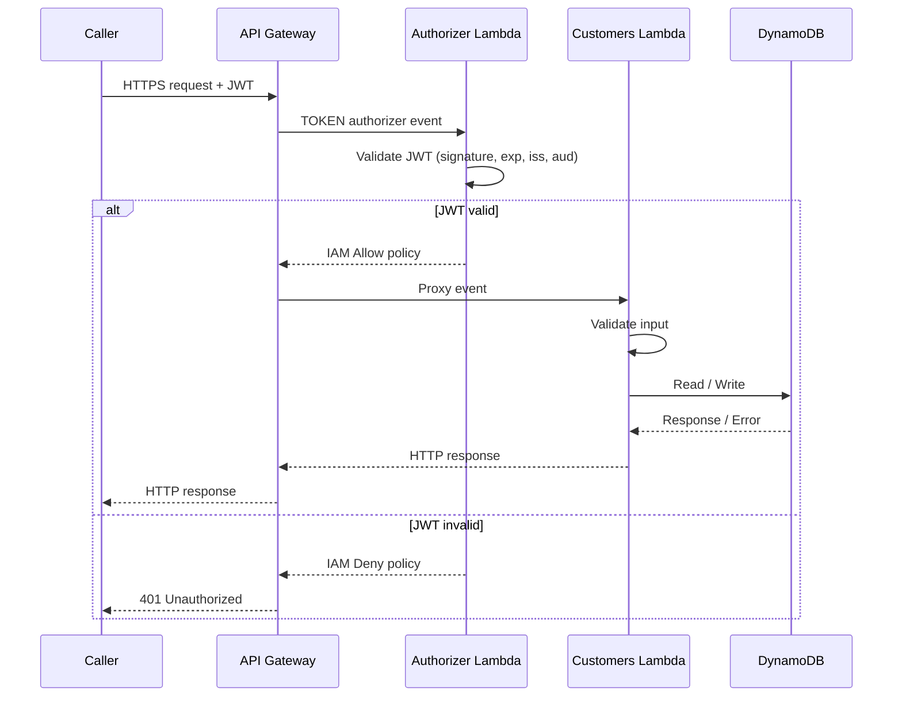

# Design Document: Customer Management Platform

## Overview

The Customer Management Platform is a serverless REST API that gives AnyCompany a single, authoritative source of customer data. The system is built entirely on AWS managed services — API Gateway for HTTP routing, Lambda for business logic, DynamoDB for persistence, and Cognito for identity management — with all infrastructure defined in Terraform.

The design follows a request-response pattern: every inbound HTTP call passes through a Lambda Authorizer that validates the caller's Cognito-issued JWT before any business logic executes. The customer CRUD Lambda then handles validated requests, applying field-level input validation before reading from or writing to DynamoDB.

### Key Design Decisions

- **Separate Lambda functions for auth and CRUD** — isolates security logic from business logic, limits blast radius of a bug in either.
- **JWT validation at the authorizer layer** — authentication is enforced uniformly at the API Gateway layer; the CRUD Lambda never receives an unauthenticated request.
- **DynamoDB GSI on email** — enables O(1) duplicate-email detection during create and update without a full table scan.
- **All errors sanitized before response** — the Lambda never leaks stack traces, ARNs, or DynamoDB error codes to callers.

---

## Architecture



### High-Level Component Map

```
internet
  └── API Gateway (REST, HTTPS-only)
        ├── Lambda Authorizer  (TOKEN type, all routes)
        │     └── Cognito JWKS endpoint (public key fetch)
        └── Customers Lambda  (ANY /customers, ANY /customers/{customer_id})
              └── DynamoDB Table
                    └── GSI: email-index (email → customer_id)
```

### Infrastructure Layout

All AWS resources are declared in Terraform under `infra/`, split one file per concern:

| File | Purpose |
|------|---------|
| `main.tf` | DynamoDB table (`customer_records`) |
| `cognito.tf` | Cognito user pool + app client |
| `iam.tf` | Lambda execution roles and least-privilege policies |
| `lambda.tf` | Lambda functions, invoke permissions, `archive_file` zips |
| `api_gateway.tf` | REST API, resources, methods, integrations, TOKEN authorizer, deployment, stage, access-log group |
| `backend.tf` | S3 remote-state backend block (settings supplied via `-backend-config`) |
| `variables.tf` | Input variable declarations |
| `outputs.tf` | Output values (API URL, Cognito pool/client ID, table name) |
| `providers.tf` | AWS provider configuration |
| `versions.tf` | Pinned Terraform and provider versions |
| `envs/dev.tfvars`, `envs/prod.tfvars` | Per-environment variable values |
| `envs/dev.s3.tfbackend`, `envs/prod.s3.tfbackend` | Per-environment remote-state backend config |
| `deployer-policy.json` | Full IAM policy attached to the `customer-platform-deployer` user |

**Remote state**: Terraform state is stored in the S3 bucket
`customer-platform-tfstate-114943206720` with locking via the DynamoDB table
`customer_records_tflock`. The bucket and lock table are provisioned once by
`scripts/bootstrap_backend.sh`. Initialize with
`terraform init -backend-config=envs/<env>.s3.tfbackend`.

---

## Components and Interfaces

### 1. Lambda Authorizer (`src/authorizer/lambda_function.py`)

**Trigger**: API Gateway TOKEN authorizer — receives an `authorizationToken` (the raw `Authorization` header value) and a `methodArn`.

**Responsibilities**:
- Extract the Bearer token from the `Authorization` header.
- Fetch the Cognito User Pool's JWKS (cached for the Lambda container lifetime) to obtain the signing public key.
- Validate the JWT: signature, `exp`, `iss` (must equal the Cognito issuer URL), and `aud` (must equal the App Client ID).
- Return an IAM policy document:
  - `Effect: Allow` for a valid token, scoped to the whole API stage
    (`arn:aws:execute-api:{region}:{account}:{apiId}/{stage}/*`) rather than the
    concrete `methodArn`. API Gateway caches the authorizer result per token
    (TTL), so a policy scoped to a single method would cause every *other* route
    to be denied (403) until the cache expired. Scoping to the whole stage
    avoids this.
  - `Effect: Deny` (or raise `Unauthorized`) for any invalid token.

**Key libraries**: `python-jose[cryptography]`.

**Packaging note**: `python-jose` (and its transitive `cryptography` dependency)
are NOT part of the Lambda runtime and must be vendored into the deployment
package as Linux wheels. `scripts/build_lambdas.sh` does this into
`build/authorizer`, which Terraform then zips. This must run before
`terraform plan`/`apply`. (The customers Lambda has no third-party deps.)

**Interface**:
```python
def lambda_handler(event: dict, context) -> dict:
    # event keys: authorizationToken, methodArn
    # returns: {"principalId": str, "policyDocument": {...}}
```

---

### 2. Customers Lambda (`src/customers/lambda_function.py`)

**Trigger**: API Gateway proxy integration for all `/customers` routes.

**Responsibilities**: Route by HTTP method and path, validate input, perform DynamoDB operations, return sanitized HTTP responses.

**Route table**:

| Method | Path | Handler function | DynamoDB operation |
|--------|------|------------------|--------------------|
| `POST` | `/customers` | `create_customer` | `put_item` |
| `GET` | `/customers` | `list_customers` | `scan` (with pagination) |
| `GET` | `/customers/{customer_id}` | `get_customer` | `get_item` |
| `PUT` | `/customers/{customer_id}` | `update_customer` | `update_item` |
| `DELETE` | `/customers/{customer_id}` | `delete_customer` | `delete_item` |

**Interface**:
```python
def lambda_handler(event: dict, context) -> dict:
    # event: API Gateway proxy event
    # returns: {"statusCode": int, "body": str (JSON), "headers": dict}
```

**Shared helper modules** (within the same Lambda package):
- `validate_customer_body(body) -> dict[str, str]` — already implemented; returns field → error message mapping.
- `is_valid_uuid4(value) -> bool` — already implemented.
- `build_response(status_code, body) -> dict` — constructs a sanitized proxy response.
- `get_dynamodb_table()` — returns a `boto3` DynamoDB `Table` resource using environment variables.

---

### 3. API Gateway

- **Type**: REST API (not HTTP API — required for Lambda TOKEN authorizer and per-stage access logging).
- **Authorizer**: TOKEN type, attached to all methods on all resources; TTL cache set to 300 seconds.
- **Resources**: `/customers` and `/customers/{customer_id}`.
- **Endpoint type**: REGIONAL.
- **Protocols**: HTTPS only (enforced by API Gateway — no HTTP fallback).
- **Access logging** (production only): the CloudWatch log group (`aws_cloudwatch_log_group.apigw_access_logs`) is created only when `environment == "prod"` (via `count`), and the stage's `access_log_settings` are likewise attached only in prod. Log format includes `$context.requestId`, `$context.httpMethod`, `$context.resourcePath`, `$context.status`, `$context.requestTime`. Note: `logs:DescribeLogGroups` is a wildcard-only IAM action, so the prod deploy requires that permission on `Resource: "*"`.

---

### 4. DynamoDB Table

- **Table name**: controlled by `customers_table_name` Terraform variable (e.g., `customer_records_dev`).
- **Billing mode**: `PAY_PER_REQUEST` (on-demand).
- **Primary key**: `customer_id` (String) — partition key only (no sort key).
- **GSI**: `email-index` — partition key `email` (String), projects `ALL` attributes.

The GSI on `email` enables fast duplicate-email detection on create and update without scanning the full table.

---

### 5. Cognito User Pool

- **Password policy**: minimum 8 characters, requires uppercase, lowercase, digit, and special character.
- **App client**: configured without a client secret (for use from server-side Lambda and API tools).
- **JWT issuance**: standard Cognito tokens; JWKS endpoint exposed at `https://cognito-idp.{region}.amazonaws.com/{userPoolId}/.well-known/jwks.json`.

---

## Data Models

### Customer Record (DynamoDB item)

| Field | Type | Required | Notes |
|-------|------|----------|-------|
| `customer_id` | String (UUID v4) | Yes | System-generated at create; partition key |
| `name` | String | Yes | 1–200 characters |
| `email` | String | Yes | RFC 5322 format; indexed via GSI |
| `phone` | String | No | 7–20 chars; digits, spaces, `-`, `+`, `(`, `)` |
| `address` | String | No | 1–500 characters |
| `created_at` | String (ISO 8601 UTC) | Yes | Set at creation; never updated |
| `updated_at` | String (ISO 8601 UTC) | No | Set on every successful PUT |

### API Request / Response Shapes

**POST /customers — Request body**:
```json
{
  "name": "Jane Smith",
  "email": "jane.smith@example.com",
  "phone": "+1 555-0100",
  "address": "123 Main St, Springfield, IL 62701"
}
```

**POST /customers — 201 Response**:
```json
{
  "customer_id": "550e8400-e29b-41d4-a716-446655440000",
  "name": "Jane Smith",
  "email": "jane.smith@example.com",
  "phone": "+1 555-0100",
  "address": "123 Main St, Springfield, IL 62701",
  "created_at": "2024-01-15T10:30:00Z"
}
```

**GET /customers — 200 Response (list)**:
```json
{
  "customers": [ { ...customer_record... } ],
  "nextToken": "base64encodedtoken"
}
```
`nextToken` is omitted when there are no further pages.

**400 Bad Request Error Response**:
```json
{
  "error": "Validation failed",
  "fields": {
    "email": "Invalid email format",
    "name": "Field is required"
  }
}
```

**Non-validation Error Response** (404, 409, 500, 503):
```json
{
  "error": "Human-readable message"
}
```

### IAM Policy Response (Authorizer)

```json
{
  "principalId": "user|<sub-claim>",
  "policyDocument": {
    "Version": "2012-10-17",
    "Statement": [{
      "Action": "execute-api:Invoke",
      "Effect": "Allow | Deny",
      "Resource": "arn:aws:execute-api:*:*:*"
    }]
  }
}
```

---

## Correctness Properties

*A property is a characteristic or behavior that should hold true across all valid executions of a system — essentially, a formal statement about what the system should do. Properties serve as the bridge between human-readable specifications and machine-verifiable correctness guarantees.*

The following properties were derived from the acceptance criteria after prework analysis. Properties that are redundant or subsumed by more comprehensive properties have been consolidated. Infrastructure and configuration criteria (Requirements 7.1–7.3, 7.5, 8.x) are excluded from PBT and covered by smoke/integration tests.

---

### Property 1: Valid JWTs are always permitted

*For any* JWT payload with valid structure, signed with the correct key, and containing valid `exp`, `iss`, and `aud` claims, the Authorizer SHALL return an IAM policy with `Effect: Allow`.

**Validates: Requirements 1.1**

---

### Property 2: Invalid JWTs are always denied

*For any* input token that is malformed, missing, signed with an unrecognized key, expired, or contains incorrect `iss`/`aud` claims, the Authorizer SHALL return an IAM policy with `Effect: Deny` (or raise `Unauthorized`).

**Validates: Requirements 1.2, 1.3, 1.4, 1.5**

---

### Property 3: Valid customer creation always succeeds with a UUID v4 ID

*For any* request body containing a non-empty `name` (≤ 200 chars) and a valid RFC 5322 `email`, along with any combination of valid optional fields, the create handler SHALL return HTTP 201 with a `customer_id` that is a valid UUID v4 string.

**Validates: Requirements 2.1, 2.2**

---

### Property 4: Created records have a valid ISO 8601 UTC created_at timestamp

*For any* successfully created customer record, the `created_at` field SHALL be a valid ISO 8601 UTC timestamp string.

**Validates: Requirements 2.5**

---

### Property 5: Invalid input is always rejected with 400 and field-level errors

*For any* create or update request body that violates at least one validation rule (missing required field, name too long, invalid email format, invalid phone format, invalid address), the Lambda SHALL return HTTP 400 with a response body that lists every failing field and its reason, and SHALL NOT perform any DynamoDB write.

**Validates: Requirements 2.3, 4.3, 6.1, 6.2, 6.3, 6.4, 6.5, 6.6**

---

### Property 6: Create-then-retrieve round trip preserves all fields

*For any* valid customer record that is successfully created (HTTP 201), a subsequent GET request to `/customers/{customer_id}` SHALL return HTTP 200 with a response body containing all fields that were present in the create request, plus `customer_id` and `created_at`, with values unchanged.

**Validates: Requirements 3.1**

---

### Property 7: GET on non-existent ID always returns 404

*For any* UUID v4 string that does not correspond to a customer in DynamoDB, a GET request SHALL return HTTP 404 with an error message and no customer data fields.

**Validates: Requirements 3.2**

---

### Property 8: Update preserves immutable fields

*For any* valid PUT request to an existing `customer_id` — regardless of whether the request body attempts to override `customer_id` or `created_at` — the response body SHALL contain the original `customer_id` and `created_at` values unchanged, and `updated_at` SHALL be a valid ISO 8601 UTC timestamp that is greater than or equal to `created_at`.

**Validates: Requirements 4.5, 4.6**

---

### Property 9: DELETE removes the record and makes it unretrievable

*For any* customer record that is successfully deleted (DELETE returns HTTP 200), a subsequent GET request for the same `customer_id` SHALL return HTTP 404.

**Validates: Requirements 5.1**

---

### Property 10: DELETE with non-UUID-v4 ID always returns 400

*For any* string that is not a valid UUID v4, a DELETE request using that string as the `customer_id` path parameter SHALL return HTTP 400 with an error message identifying the malformed ID.

**Validates: Requirements 5.4**

---

### Property 11: Responses never expose internal error details

*For any* request that results in an error response (4xx or 5xx), the response body SHALL NOT contain stack traces, DynamoDB error codes, internal resource ARNs, or raw exception messages.

**Validates: Requirements 7.4**

---

## Error Handling

### Authorizer Lambda

| Condition | Behavior |
|-----------|----------|
| Valid JWT | Return Allow policy |
| Expired JWT | Raise `Exception("Unauthorized")` → API Gateway returns 401 |
| Malformed / missing JWT | Raise `Exception("Unauthorized")` → API Gateway returns 401 |
| Wrong key / signature | Raise `Exception("Unauthorized")` → API Gateway returns 401 |
| Wrong `iss` or `aud` | Raise `Exception("Unauthorized")` → API Gateway returns 401 |
| JWKS fetch failure | Raise `Exception("Unauthorized")` (fail closed) → 401 |

Raising `Exception("Unauthorized")` is the API Gateway convention for TOKEN authorizers to return a 401. Returning a Deny policy instead produces a 403.

### Customers Lambda

| Condition | HTTP Status | Response body |
|-----------|------------|---------------|
| Validation failure (one or more fields) | 400 | `{"error": "...", "fields": {...}}` |
| Non-UUID-v4 path parameter | 400 | `{"error": "..."}` |
| Resource not found | 404 | `{"error": "..."}` |
| Duplicate email | 409 | `{"error": "..."}` |
| DynamoDB unavailable (write) | 500 | `{"error": "An internal error occurred"}` |
| DynamoDB unavailable (read/delete) | 503 | `{"error": "Service temporarily unavailable"}` |
| Unexpected exception | 500 | `{"error": "An internal error occurred"}` |

All error responses are built through a shared `build_response` helper that explicitly strips any exception message, stack trace, or AWS-internal detail before serializing to JSON.

---

## Testing Strategy

This project uses **pytest** for both unit and property-based tests. Property-based tests use the [**Hypothesis**](https://hypothesis.readthedocs.io/) library, which is the standard PBT library for Python.

### Directory Layout

```
tests/
├── unit/
│   ├── test_authorizer.py          # Unit and property tests for JWT validation
│   ├── test_customers_validation.py # Property tests for input validation logic
│   ├── test_customers_crud.py       # Property and example tests for CRUD handlers
│   └── events/                      # Static JSON event fixtures
└── integration/
    └── test_api_integration.py      # Integration tests against deployed API
```

### Unit / Property Tests

Property tests use `@given` decorators with Hypothesis strategies and are configured to run a minimum of 100 examples per property via `settings(max_examples=100)`.

Each property test is tagged with a comment linking it back to the design property:
```python
# Feature: customer-management-platform, Property 3: Valid customer creation always succeeds with a UUID v4 ID
```

**Authorizer tests** (`test_authorizer.py`):
- **Property 1**: `@given` valid JWT payloads with varying `sub`, custom claims, and realistic `exp` values — verify `Effect: Allow` in all cases.
- **Property 2**: `@given` arbitrary strings (not valid JWTs) and JWTs signed with wrong keys, expired tokens, tokens with wrong `iss`/`aud` — verify `Effect: Deny` or `Unauthorized` raised.
- **Example**: Specific edge cases — missing `Authorization` header, `Bearer ` prefix absent.

**Customers validation tests** (`test_customers_validation.py`):
- **Property 5**: `@given` invalid customer body dicts (missing required fields, names > 200 chars, non-RFC-5322 emails, invalid phone strings) — verify `validate_customer_body` returns non-empty errors dict with correct field keys.
- **Property 10**: `@given` arbitrary strings that are not UUID v4 — verify `is_valid_uuid4` returns `False`.
- **Edge cases**: boundary values for `name` (1, 200, 201 chars), `phone` (6, 7, 20, 21 chars), `address` (1, 500, 501 chars).

**Customers CRUD tests** (`test_customers_crud.py`) — DynamoDB is mocked via `unittest.mock.patch` / `moto`:
- **Property 3**: `@given` valid customer create bodies — verify HTTP 201 and UUID v4 `customer_id` in response.
- **Property 4**: `@given` valid create bodies — verify `created_at` is parseable as ISO 8601 UTC.
- **Property 6**: `@given` valid customer records — create then GET, verify all fields match.
- **Property 7**: `@given` UUID v4 strings not in the table — verify GET returns 404.
- **Property 8**: `@given` valid existing customers + valid update bodies — verify `customer_id` and `created_at` unchanged, `updated_at` is valid ISO 8601 and >= `created_at`.
- **Property 9**: `@given` valid customers — create, DELETE (verify 200), GET (verify 404).
- **Property 11**: `@given` various error conditions (mocked DynamoDB failures, invalid inputs) — verify no response body contains stack traces or ARNs.
- **Examples**: Duplicate email → 409; DynamoDB error on write → 500; DynamoDB error on read → 503; pagination with > 100 records returns `nextToken`.

### Integration Tests

Run against the deployed API using real AWS credentials. Each test uses 1–3 examples (not property-based), suitable for CI post-deployment smoke verification.

- Unauthenticated request to any `/customers` endpoint → 401 at API Gateway.
- Full CRUD lifecycle with a real JWT.
- Verify API is HTTPS-only.
- Verify access logging in CloudWatch (production environment only).

### What is NOT property-tested

- Terraform infrastructure (tested via `terraform plan` and `terraform validate`).
- API Gateway authorizer wiring (tested via integration test).
- Cognito password policy (verified by reviewing Terraform resource configuration).
- HTTPS enforcement (verified by integration test and Terraform review).
