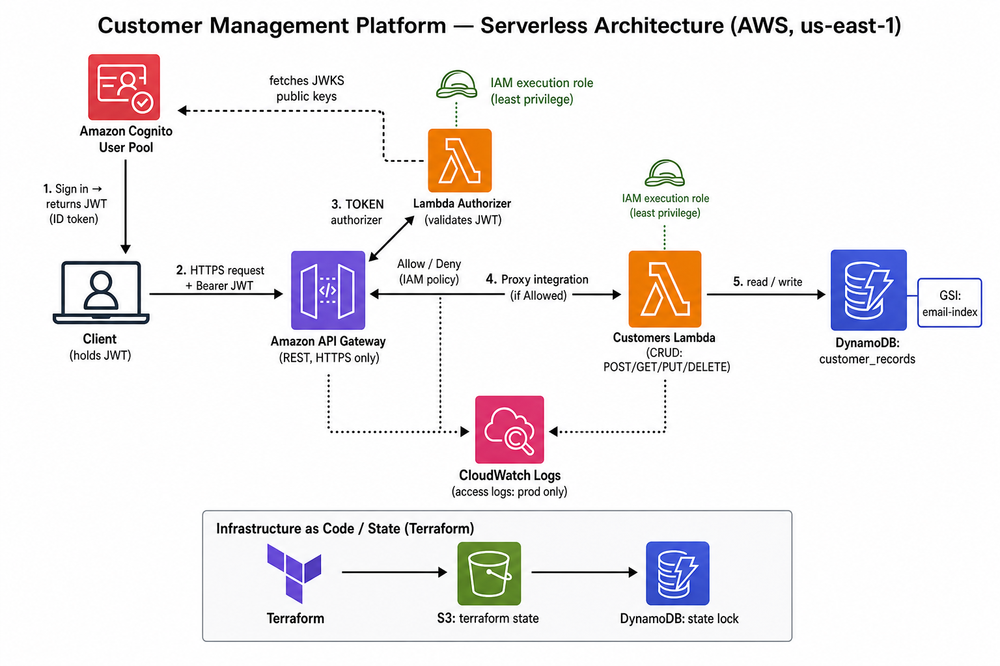
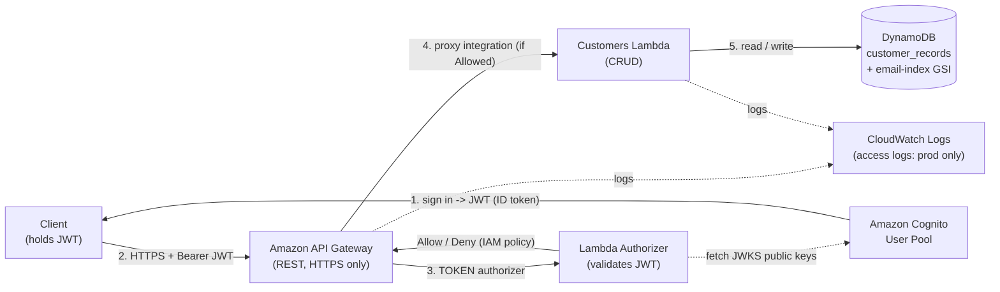

# Customer Management Platform

A serverless REST API for managing customer records on AWS, built with Python
Lambda functions, API Gateway, DynamoDB, and Cognito — all provisioned with
Terraform. Authentication is enforced at the edge by a Lambda Authorizer that
validates Cognito-issued JWTs before any business logic runs.

> This project was originally scaffolded with a spec-driven workflow; the specs
> live in [`.kiro/specs/customer-management-platform/`](.kiro/specs/customer-management-platform/)
> (requirements, design, and the task plan).

## Architecture



The diagram above is a rendered image. The **editable, version-controlled**
source is the Mermaid diagram below — adjust it here and it re-renders on GitHub:



### Two different "users" (important)

- **Cognito users** are *logins* — the authenticated operators allowed to call
  the API. Cognito issues their JWTs.
- **Customer records** (`POST /customers`, etc.) are *business data* stored in
  DynamoDB. They are the subject of the API, not accounts, and cannot log in.

The `email` on a customer record is unrelated to any Cognito login.

## Repository layout

```
src/
  authorizer/     JWT-validation Lambda (vendors python-jose; see build step)
  customers/      CRUD Lambda (lambda_function.py + utils.py)
tests/
  unit/           pytest + Hypothesis property tests (mocked with moto)
  integration/    example tests against a deployed stack
infra/            Terraform (split per concern: main, cognito, iam, lambda,
                  api_gateway, backend), envs/, and deployer-policy.json
scripts/
  bootstrap_backend.sh   one-time: create S3 state bucket + DynamoDB lock table
  build_lambdas.sh       vendor authorizer deps as Linux wheels before deploy
  import_existing_dev.sh import pre-existing dev resources into TF state
```

See [`.kiro/steering/structure.md`](.kiro/steering/structure.md) for the full tree.

## Prerequisites

- [Terraform](https://developer.hashicorp.com/terraform/downloads) >= 1.5
- Python 3.12 and `pip`
- AWS credentials configured (this project uses the `customer-platform` profile
  for deploys, targeting account `114943206720` in `us-east-1`)

## Deploy

```bash
# 0. (one time per account, admin creds) create the remote-state backend
AWS_PROFILE=<admin-profile> ./scripts/bootstrap_backend.sh

# 1. vendor the authorizer's third-party deps (python-jose, etc.) as Linux wheels.
#    REQUIRED before plan/apply — archive_file only zips source, it does not pip install.
./scripts/build_lambdas.sh

# 2. init the S3 backend and deploy
cd infra
terraform init -backend-config=envs/dev.s3.tfbackend
terraform plan  -var-file=envs/dev.tfvars
terraform apply -var-file=envs/dev.tfvars
```

For prod, swap `dev` → `prod` in the `-backend-config` and `-var-file` flags.
Prod additionally creates a CloudWatch access-log group, which requires
`logs:DescribeLogGroups` on `Resource: "*"` in the deployer policy (a
wildcard-only IAM action).

If the target account already contains some of these resources, import them
first (idempotent):

```bash
AWS_PROFILE=customer-platform ./scripts/import_existing_dev.sh
```

## API

All endpoints require an `Authorization: Bearer <Cognito ID token>` header.

| Method | Path | Description | Success |
|--------|------|-------------|---------|
| POST   | `/customers` | Create a customer | 201 |
| GET    | `/customers` | List customers (paginated via `nextToken`) | 200 |
| GET    | `/customers/{customer_id}` | Retrieve one | 200 |
| PUT    | `/customers/{customer_id}` | Update (preserves `customer_id`, `created_at`) | 200 |
| DELETE | `/customers/{customer_id}` | Delete | 200 |

Errors: `400` validation (with per-field messages), `401` missing/invalid token,
`404` not found, `409` duplicate email, `5xx` sanitized internal errors.

### Getting a token

With a confirmed Cognito user (username + permanent password), mint an ID token
using the public `USER_PASSWORD_AUTH` flow (no IAM permissions needed):

```bash
aws cognito-idp initiate-auth \
  --auth-flow USER_PASSWORD_AUTH \
  --client-id <app_client_id> \
  --auth-parameters USERNAME=<user>,PASSWORD=<password> \
  --region us-east-1 \
  --query 'AuthenticationResult.IdToken' --output text
```

Then call the API, e.g.:

```bash
curl -X POST "$API_URL/customers" \
  -H "Authorization: Bearer $TOKEN" -H "Content-Type: application/json" \
  -d '{"name":"Jane Smith","email":"jane@example.com","phone":"+1 555-0100"}'
```

## Testing

```bash
pip install -r tests/requirements.txt
pytest tests/unit/          # unit + property-based tests (mocked, no AWS)
pytest tests/integration/   # requires a deployed stack + env vars
```

## Deployed dev environment

| Resource | Value |
|----------|-------|
| API URL | `https://v87sbmnj0b.execute-api.us-east-1.amazonaws.com/v1` |
| Cognito User Pool | `us-east-1_GKF6gO5De` |
| Cognito App Client | `6a8qqf8he5075bucjnb7uc47g2` |
| DynamoDB table | `customer_records_dev` |

## License

Copyright AnyCompany, Inc. or its affiliates. All Rights Reserved.
